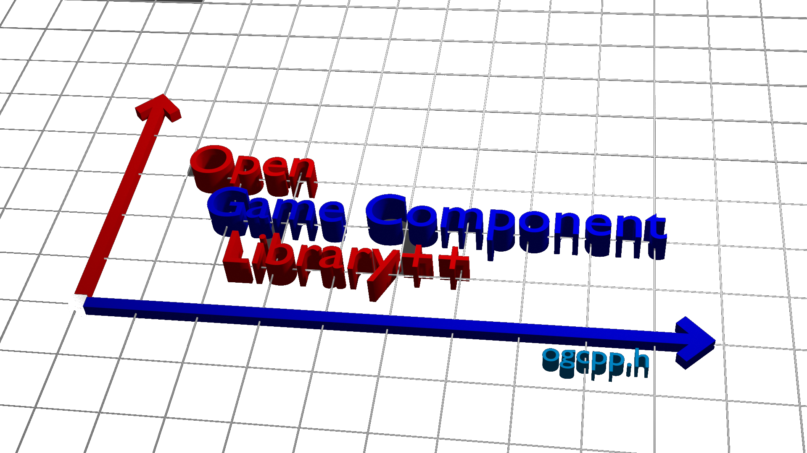

# Open Game Component Library++

The Open Game Component Library++ is the C++ interface of the JavaScript Game-Library <a href="https://github.com/mattes2008/OpenGameComponentLibrary" target="blank">Open Game Component Library</a>.
It contains different components, which help you to make your own game.

## Gtkmm

This Library uses the C++ interface, <a href="https://www.gtkmm.org/en/index.html" target="blank">gtkmm</a>, of the GUI-Library <a href="https://www.gtk.org" target="blank">GTK+</a>
**The links above lead to external websites, which aren't under my control. I do not have any influence on the content of them.**

## Get Started

### 1. Requirements

 - a C++ compiler like g++
 - the C++ interface of the GUI library GTK+, gtkmm 3.0

### 2. Download

- download the headerfiles of ogcpp: <a href="https://github.com/mattes2008/OpenGameComponentLibrary/archive/refs/heads/master.zip">here</a>
- extract the files of the zip-file
- move the "src"-directory to your project directory

Finally your project directory should look like this:

```c
  Project
  | main.cpp
  |_src
  | | ogcpp.h
  | |_ogcpp
  | | | ...
  | | |_________
  | |___________
  |_storage
  | |___________
  |_____________
```

### 3. Hello World

main.cpp:

```cpp
  #include "src/ogcpp.h"

  int main (int argc, char* argv[]) {
    auto app = Gtk::Application::create(argc, argv, "org.gtkmm.example");
    Stage stage("Hello World");
    return app->run(stage.window);
  }
```

You can also include only single components like "core".

```c
  #include "src/ogcpp/core.h"
```

Compile the file (Example with g++):

```g++ main.cpp `pkg-config gtkmm-3.0 --cflags --libs` -o main ```

## Disclaimer

We assume no liability for any impact on your computer.
